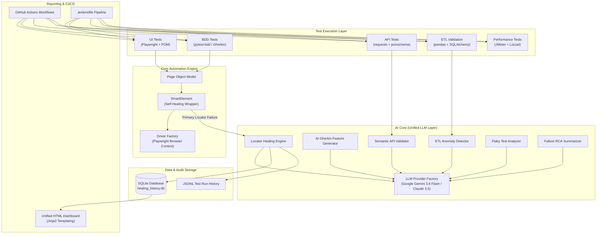

# AI-Powered Self-Healing Test Automation Framework

<div align="center">


[](https://vercel.com/new/clone?repository-url=https%3A%2F%2Fgithub.com%2FErSHAAD-code%2FAI-Powered-Self-Healing-Test-Automation-Framework)

**An Enterprise AI-Powered Self-Healing Test Automation Framework Across UI, BDD, API, ETL/Database, and Performance Testing Pillars.**

[Features](#-key-capabilities) • [Architecture](#-system-architecture) • [Quick Start](#-quick-start) • [Self-Healing Demo](#-self-healing-pipeline-demo) • [Test Suites](#-test-suite-execution) • [CI/CD](#-cicd-pipeline-integration)

</div>

---

## 🌟 Executive Summary

The **AI-Powered Self-Healing Test Automation Framework** is an end-to-end enterprise test automation platform designed to demonstrate modern AI/ML augmentation across all Quality Assurance pillars. 

Rather than isolated test scripts, this platform provides a unified **AI Core Layer** (Google Gemini + Anthropic Claude) that injects intelligent decision-making into:
1. **UI Automation**: Playwright + Page Object Model with **SmartElement Self-Healing**.
2. **BDD Testing**: Pytest-BDD Gherkin specification execution & AI Gherkin Generator.
3. **API Quality**: Schema assertion + **AI Semantic Response Validation**.
4. **ETL & Data Pipelines**: Rule-based data reconcilation + **AI Data Quality Anomaly Detection**.
5. **Performance Engineering**: Locust load testing + JMeter `.jmx` execution + automated SLA regression checks.
6. **Test Operations**: Automated Flaky Test Detection & AI Root Cause Analysis (RCA).

---

## 🏗️ System Architecture



---

## ⚡ Key Capabilities

| Pillar | Capability | Description |
| :--- | :--- | :--- |
| 🛡️ **UI Self-Healing** | **Playwright + SmartElement** | Automatically catches broken locators at runtime, extracts DOM context, generates AI candidates via Gemini/Claude, validates candidates against active DOM, and auto-heals with zero test downtime. |
| 🥒 **BDD Testing** | **Pytest-BDD + AI Generator** | Gherkin scenario execution integrated with POM, plus an AI feature generator script to convert plain requirements into Gherkin features. |
| 📡 **API Contract & AI** | **Requests + JSON Schema** | Validates HTTP status codes, JSON Schemas, headers, role permissions, and uses LLM semantic evaluation for unstructured response payload bodies. |
| 📊 **ETL & Data Quality** | **Pandas + SQLAlchemy** | Source vs Target table reconciliation (Row count, PK integrity, column sums, cross-math) combined with LLM data drift & anomaly detection. |
| 🚀 **Performance** | **Locust + JMeter** | Automated Locust load test tasks, JMeter `.jmx` execution, and SLA regression assertion tests (P95/P99 latency, throughput, error rates). |
| 📈 **Unified Dashboard** | **Jinja2 HTML Reporting** | Aggregates test metrics, healing event logs, flaky test classifications, and failure RCA summaries into `reports/unified_report.html`. |

---

## 🛠️ Quick Start & Installation

### Prerequisites
- **Python 3.10+** (Python 3.12 / 3.14 tested)
- **Git**
- **Node / Playwright Browsers** (installed automatically)

### 1. Clone the Repository
```bash
git clone https://github.com/<your-username>/ai-powered-self-healing-framework.git
cd ai-powered-self-healing-framework
```

### 2. Create Virtual Environment
```bash
python -m venv venv
# On Windows PowerShell:
.\venv\Scripts\Activate.ps1
# On Linux/macOS:
source venv/bin/activate
```

### 3. Install Dependencies
```bash
pip install -r requirements.txt
playwright install chromium
```

### 4. Configure Environment Variables
Copy `.env.example` to `.env`:
```bash
cp .env.example .env
```

Edit `.env` with your Google Gemini API key:
```env
GOOGLE_API_KEY=AQ.Ab8RN6...
LLM_PRIMARY_PROVIDER=gemini
GEMINI_MODEL=gemini-3.6-flash
```
*(Note: If no API key is provided, the platform automatically runs using `MockLLMProvider` offline).*

---

## 🎬 Self-Healing Pipeline Demo

To run the interactive end-to-end self-healing demonstration:

```bash
python run_demo.py
```

### Demonstration Steps:
1. Launches local HTTP web application on `http://localhost:8000`.
2. Runs UI login test with valid locators (Passes).
3. **Mutates the DOM in real-time** (simulates UI refactoring, changes element IDs).
4. Runs UI login test with broken locators:
   - `#username` ➔ Auto-healed to `#user-email-input` (**99% Confidence**, Gemini 3.6 Flash)
   - `#password` ➔ Auto-healed to `#user-password-input` (**99% Confidence**, Gemini 3.6 Flash)
   - `#login-button` ➔ Auto-healed to `#btn-signin-primary` (**98% Confidence**, Gemini 3.6 Flash)
5. Generates interactive HTML healing report at `reports/healing_report.html`.

---

## 🧪 Test Suite Execution

Run all **39 tests** across all Quality Engineering pillars:

```bash
pytest --tb=short
```

### Run Specific Testing Pillars

#### 1. UI Automation Tests
```bash
pytest tests/
```

#### 2. BDD Gherkin Feature Tests
```bash
pytest bdd/
```

#### 3. API Contract & AI Tests
```bash
pytest api_tests/
```

#### 4. ETL Validation & Data Quality
```bash
pytest etl_validation/
```

#### 5. Performance Regression Tests
```bash
pytest performance/
```

---

## 📊 Unified Dashboard & Reporting

Generate the aggregated HTML summary dashboard containing metrics across all 5 pillars:

```bash
python reporting/ai_summary_report_generator.py
```

Open `reports/unified_report.html` in any browser to inspect:
- Total execution stats across UI, API, ETL, BDD, Performance.
- Live locator healing logs with confidence scores and LLM reasoning.
- Flaky test detection & failure Root Cause Analysis (RCA).

---

## 🔄 CI/CD Pipeline Integration

The framework includes pre-configured CI/CD configurations for enterprise deployment:

- **GitHub Actions Workflows**: [`.github/workflows/ci.yml`](.github/workflows/ci.yml)
  - Multi-job parallel test execution (UI, API, ETL, Performance).
  - Artifact archiving for healing logs and HTML reports.
- **Jenkins Pipeline**: [`Jenkinsfile`](Jenkinsfile)
  - Pipeline stages: Build ➔ Test (Parallel) ➔ Security Audit ➔ Unified Reporting ➔ Deployment.

---

## 📂 Project Directory Structure

```text
AI-Powered-Self-Healing-Test-Automation-Framework/
├── .github/workflows/ci.yml   # GitHub Actions CI workflow
├── Jenkinsfile                 # Jenkins declarative pipeline
├── README.md                   # Platform documentation
├── requirements.txt            # Python dependencies
├── pytest.ini                  # PyTest runner configuration
├── run_demo.py                 # Live self-healing interactive demonstration
│
├── ai_core/                    # Unified AI / LLM Core Layer
│   ├── llm/                    # Base provider, Claude, Gemini, Mock LLM factory
│   ├── locator_healing/        # Healing engine, DOM extractor, validator, confidence gate
│   ├── gherkin_gen/            # AI feature generator
│   ├── api_contract_check/     # Semantic response validator
│   ├── anomaly_detection/      # ETL anomaly detector
│   └── failure_analysis/       # Flaky test detector & RCA summarizer
│
├── core/                       # Automation Core (Playwright driver, SmartElement)
├── pages/                      # Page Object Model (LoginPage, DashboardPage)
├── demo_app/                   # Demo web application (HTML/CSS/JS)
├── tests/                      # UI & framework unit tests
├── bdd/                        # Gherkin feature files & step definitions
├── api_tests/                  # API functional & contract tests
├── etl_validation/             # Source vs Target data reconciler & rules
├── performance/                # Locust load scripts, JMeter .jmx & SLA regression tests
├── reporting/                  # Unified Jinja2 HTML report generator
├── reports/                    # Output directory for HTML dashboards
└── data/                       # SQLite DB (healing history) & audit logs
```

---

## 📄 License

This project is licensed under the **MIT License** — see the `LICENSE` file for details.
